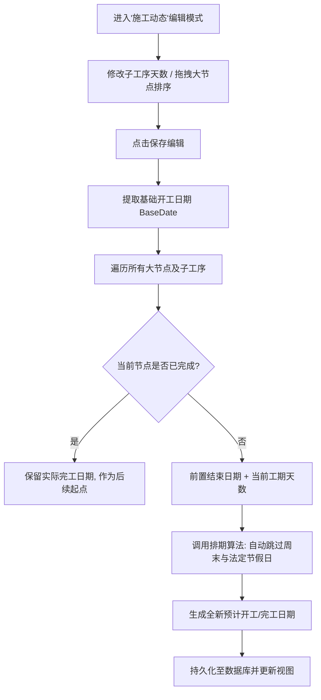
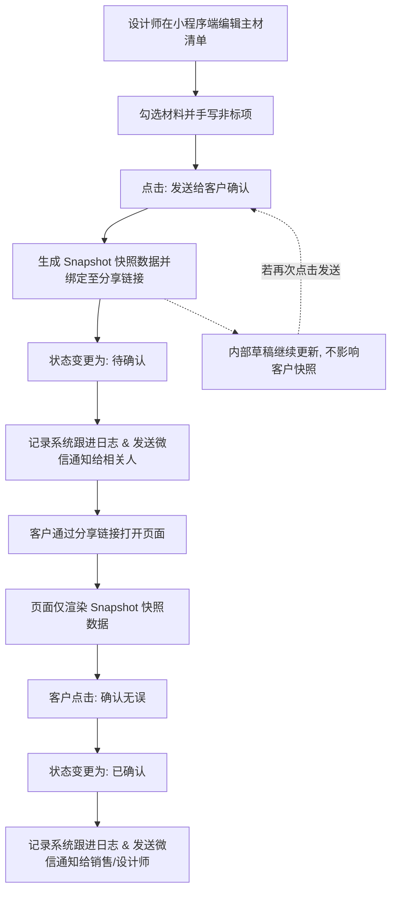

# 品诺筑家 (PNZJ) - 轻量化整装全链路管理系统 PRD (V1.2)

> **修订说明 (2026-04-27)**：本次更新已将《系统架构》、《数据埋点方案》、《开发路线图》以及《客户查看权限申请功能》等技术与产品文档进行大一统合并，作为全量、详尽的系统产品需求与架构文档。

## 1. 执行摘要 (Executive Summary)
我们正在为“品诺筑家”（一家约20人的整装团队）打造一款**轻量化、高质感、全链路贯通**的 CRM+ERP 融合管理系统。解决当前团队在线索流转、报价制作、材料库管理与施工节点把控中存在的“数据孤岛”与“流程僵化”问题。通过解耦报价与材料库、引入客户意向评级 (A/B/C/D) 和 8个标准施工节点的可视化管控，我们将提升销售转化率至少 15%，并将工长的现场管理效率提升 30%，实现从“客户进店”到“项目竣工”的单一数据源全生命周期追踪。

---

## 2. 项目背景与问题陈述 (Problem Statement)

### 谁遇到了问题？
品诺筑家的老板、销售、设计师、工长以及财务。他们目前缺乏一个贴合其业务体量（20人团队）的数字化工具。

### 问题是什么？ (Core Pain Points)
基于目前团队实际的运作状态与历史踩坑经验，我们面临着以下五个深层次的业务痛点：

1. **跟进滞后与管理瓶颈 (Excel时代的低效陷阱)**
   * 过去极度依赖格式各异的传统 Excel 表格，且数据不互通。销售线索跟进往往要等到“每周一次的例会”才进行同步更新。
   * **深层影响**：家装客户决策窗口期极短，周级别的滞后会导致大量高意向客户（A/B级）白白流失。同时，数据维护高度依赖老板一人，老板沦为“进度催办员”和“表哥”，难以抽身做核心战略决策。
2. **“人少工地多”导致的交付黑盒 (沟通断层)**
   * 公司业务发展快，项目经理（工长）人手处于超负荷运转状态。在多个工地间疲于奔命时，工长经常忘记在关键节点（如材料进场、水电验收）向微信群或客户汇报。
   * **深层影响**：施工过程成了“黑盒”，不仅老板无法掌握真实进度，更会引发客户的焦虑和不信任，损害公司“品诺有心，筑家有道”的品牌口碑。
3. **跨角色信息孤岛 (部门间协同错位)**
   * 销售前端沟通的特殊需求、设计师出的最新方案、与工长实际拿到手的施工要求，常常“对不齐”。
   * **深层影响**：缺乏一个贯穿始终的“单一数据源 (Single Source of Truth)”。各部门用不同的工具（微信群、纸质本、Excel），极易出现漏项、错项和部门间的相互扯皮。
4. **传统SaaS的“水土不服”与工具疲劳 (历史弃用史)**
   * 团队之前花钱买过市面上的成熟管理系统，但最终没坚持用下去。原因是那些系统多针对500人以上大企业设计，功能严重冗余、操作极其繁琐。
   * **深层影响**：繁琐的系统增加了员工的抵触情绪，尤其是对于需要在工地现场用手机操作的工长来说简直是灾难。系统必须足够“轻量化”和“傻瓜化”，才能真正落地执行。
5. **报价机制僵化与 UI 审美疲劳 (系统表现层)**
   * 现有的 SaaS 要求报价死板地绑定材料库，无法应对家装中高频的“灵活手写非标项”（如个性化拆除费）。同时，传统企服软件的 UI 显得笨重廉价，无法匹配公司高品质家装的品牌调性。

### 为什么需要现在解决？ (Why Now?)
随着公司业务量的增长，依靠微信群和 Excel 管理客户和工地的模式已达到瓶颈。漏单、错报价、延期交工的隐性成本正在侵蚀公司的利润率与口碑（“品诺有心，筑家有道”）。

---

## 3. 目标用户与角色画像 (Target Users & Personas)

### 核心角色画像
| 角色 | 画像特征与痛点 (Pain Points) | 核心目标 (Jobs-to-be-done) |
| :--- | :--- | :--- |
| **老板/高管** | **痛点**: 看不到全局数据，不知道哪个环节流失率最高，工地延期无法预警。<br>**特征**: 注重数据大盘，需要掌控全局。 | 实时查看公司营收、转化率漏斗；监控施工延期预警；统筹人员组织架构。 |
| **销售** | **痛点**: 客户多且杂，容易忘记跟进；不知道客户处于什么阶段。<br>**特征**: 行动派，不喜欢填繁琐的表单。 | 快速录入线索；为客户打标签 (A/B/C/D) ；写跟进记录；移交设计师。 |
| **设计师** | **痛点**: 制作报价单繁琐，核算容易出错；有些非标项目系统录不进去。<br>**特征**: 注重效率和灵活性。 | 查阅材料大厅标准库；一键生成报价单并支持灵活手写；跟踪客户确认状态。 |
| **工长** | **痛点**: 不想用复杂的软件；在工地用电脑不现实。<br>**特征**: 移动端为主，注重简单粗暴。 | 接收派单；在 8个施工节点（如水电、瓦工）拍照打卡上传。 |
| **财务** | **痛点**: 无法及时核对回款与待办事项；看太多的客户敏感信息存在泄露风险。<br>**特征**: 主要在办公室使用，严谨细致。 | 通过待办模块协同；查看只读且脱敏的客户信息进行财务核对与状态标记。 |

---

## 4. 用户旅程与业务场景 (User Journey & Scenarios)

### 典型使用场景
**场景 A：高意向客户的极速转化**
王销售在门店接待了张先生（毛坯新房），在手机上快速录入信息并标记为 **A级**。系统自动提示分配设计师。赵设计接手后，从**材料大厅**直接拉取“39800极简整装套餐”，再手动加上 500 元的“垃圾清运费”，生成报价单。张先生确认后，系统状态变更为“已签单”。

**场景 B：无缝切入施工阶段**
一旦张先生的单子变更为“已签单”，系统**自动**在“施工管理”模块生成一条新项目，并由老板指派给李工长。该项目头顶带有 **VIP (A级客户透传)** 标识。李工长进场后，点开项目，点击第1节点“开工交底”，上传现场照片，状态变更为“进行中”。

**场景 C：客户随时查验与权限管控**
张先生在外地出张，想看工地进度。他打开销售发来的分享链接。系统检测他是业主本人（手机号验证一致），自动放行。而他的亲戚想看，则需要提交“查看申请”，销售在手机上收到微信订阅消息通知后，点击“通过”，亲戚才能查阅工地照片。

---

## 5. 系统架构与技术实现 (System Architecture)

```
CM1.0/
├── web/                    # 网页端（Next.js 14）
│   └── src/
│       ├── app/            # 页面路由
│       │   ├── page.tsx              # 首页数据看板
│       │   ├── leads/                # 线索管理
│       │   ├── projects/             # 项目管理（甘特图）
│       │   ├── quotes/               # 报价单
│       │   ├── contracts/            # 合同管理（1.0 为 mock）
│       │   ├── materials/            # 材料库
│       │   ├── todos/                # 待办任务
│       │   ├── employees/            # 员工管理
│       │   ├── notifications/        # 通知中心
│       │   ├── profile/              # 个人中心
│       │   └── api/                  # 后端 API 路由
│       ├── components/     # 公共组件
│       │   ├── MainLayout.tsx        # 主布局（导航栏、权限拦截）
│       │   ├── CustomerInfo.tsx      # 客户信息卡片
│       │   └── CustomerDocuments.tsx # 客户文件管理
│       ├── lib/            # 工具库
│       │   ├── wechat-tcb.ts         # TCB 云数据库操作封装
│       │   ├── date.ts               # 日期工具（工作日计算）
│       │   └── dateUtils.ts          # 日期格式化
│       └── models/         # Mongoose 模型（目前未使用，仅作参考）
│
└── mini-program/           # 微信小程序端
    ├── app.js              # 小程序入口（初始化云开发）
    ├── pages/              # 页面
    │   ├── index/          # 首页（待办列表）
    │   ├── leads/          # 线索列表
    │   ├── leadDetail/     # 线索详情（含设计甘特图）
    │   ├── projects/       # 项目列表
    │   ├── projectDetail/  # 项目详情（含施工甘特图）
    │   ├── quotes/         # 报价单列表
    │   ├── materials/      # 材料库
    │   ├── notifications/  # 通知中心
    │   ├── employees/      # 团队成员
    │   ├── profile/        # 个人中心
    │   └── login/          # 登录页
    └── utils/
        ├── date.js         # 日期工具
        └── format.js       # 数据脱敏（maskName/maskPhone/maskAddress）
```

---

## 数据库集合（TCB 云数据库）

| 集合名 | 用途 | 关键字段 |
|--------|------|---------|
| `users` | 员工账号 | `name`, `phone`, `account`, `role`, `passwordPlain`（待改为 hash）, `status` |
| `leads` | 客户线索 | `name`, `phone`, `customerNo`, `status`, `sales`, `designer`, `rating`, `files` |
| `followUps` | 跟进记录 | `leadId`, `content`, `method`, `createdBy`, `createdAt` |
| `projects` | 施工项目 | `customer`, `manager`, `startDate`, `status`, `nodesData`（8大节点甘特数据） |
| `quotes` | 报价单 | `customerName`, `items`, `total`, `sales`（缺 leadId 关联） |
| `materials` | 材料库 | `name`, `brand`, `spec`, `unit`, `price`, `category` |
| `todos` | 待办任务 | `title`, `priority`, `status`, `assignees`, `dueDate`, `relatedTo` |
| `notifications` | 通知消息 | `title`, `content`, `targetUser`, `isRead`, `isStarred`, `type` |
| `shareAccess` | 客户查看权限申请 | `projectId`, `openid`, `name`, `relation`, `status`, `autoApproved` |
| `events` | 数据埋点 | `eventName`, `userId`, `platform`, `properties`, `timestamp` |

---

## 权限体系

| 角色 | 标识 | 权限说明 |
|------|------|---------|
| 超级管理员 | `admin` | 全部功能，可看所有数据，可管理员工 |
| 销售/客服 | `sales` | 线索（只能看自己负责的）、报价单、待办；禁止修改项目 |
| 设计师 | `designer` | 线索（只能看自己负责的）、报价单；禁止修改项目 |
| 项目经理 | `manager` | 项目管理（全部）、待办；线索只读 |

### 数据脱敏规则
- 非本人负责的线索：姓名显示为"李**"，手机号显示为"138****0000"，地址数字替换为"*"
- admin 角色不脱敏，看到完整信息

---

### 5.4 关键技术机制 (V1.2+ 新增)
1. **主材清单快照解耦机制 (Snapshot)**：主材清单分享给客户时采用快照机制。员工端点击发送时，将当前数据存入快照，客户页面只渲染快照数据。这确保了客户只看到被发送的版本，与员工端后续的修改彻底解耦。
2. **大节点签字与状态流转架构 (并行子工序)**：采用“首尾特殊化工序”方案。首节点（交底）和尾节点（验收）设为签字节点。首节点签字后激活中间所有小工序（并行执行）；尾节点签字后激活下一个大节点。
3. **微信订阅消息通知**：利用云函数 `sendSubscribeMessage` 结合前端授权，在状态变更、审核申请时主动向员工或客户推送微信提醒（需传递 `miniprogramState`）。
4. **云存储跨用户访问机制**：云存储图片的默认权限设为“所有用户可读，仅创建者可读写”，解决小程序中非创建者无法查看图片无限转圈的问题。

---

## 6. 业务逻辑流程图 (Business Process Flow)

### 6.1 核心业务全链路流转图
```mermaid
graph TD
    subgraph 阶段一：CRM 客户线索转化与跟进
        A["销售录入新线索"] --> B["跟进并更新 A/B/C/D 评级"]
        B --> C{"是否成单?"}
        C -->|否| D["标记为无效/流失"]
        C -->|是| E["状态变更为已签单"]
        E --> F(("触发撒花动效与签单+1"))
        F --> G["分配设计师 / 制定出图排期"]
    end

    subgraph 阶段二：报价管理与材料库联动
        G2["设计师量房 & 出方案"] --> H["创建专属报价单"]
        H --> I["引用材料大厅标准品 + 手写非标项"]
        I --> J["系统实时核算总价与折后价"]
        J --> K{"客户确认签约?"}
        K -- 退回修改 --> H
        K -- 是 --> L["记录签约状态（合同模块 v2.0 接入）"]
    end

    subgraph 阶段三：ERP 施工节点与动态排期管控
        M["基于已签单客户自动生成工地"] --> N["老板指派项目经理"]
        N --> O["设置项目实际开工日期"]
        O --> P["系统自动生成施工动态排期<br>跳过周末/节假日"]
        P --> Q["工长/管理员编辑排期"]
        Q --> R{"节点是否超时?"}
        R -- 是 --> S["健康度标红 / 列表置顶预警"]
        R -- 否 --> T["现场照片上传 / 节点打卡验收"]
        S --> T
        T --> U["8大节点验收完毕 -> 项目竣工"]
    end

    G --> G2
    L --> M
```

### 6.2 施工排期重算逻辑 (Gantt Recalculation)


### 6.3 客户查看权限审批流转图 (Share Access Approval Flow)
```mermaid
graph TD
    A["外部用户打开工地分享链接"] --> B{"是否已登录为员工账号?"}
    B -->|是| C["直接放行查看"]
    B -->|否| D{"是否有已通过的申请记录?"}
    D -->|是| C
    D -->|否| E["提示: 需验证身份或提交申请"]
    E --> F["点击: 微信一键验证手机号"]
    F --> G{"手机号是否匹配当前客户?"}
    G -->|匹配 (业主本人)| H["自动生成通过记录 autoApproved:true"]
    H --> C
    G -->|不匹配| I["填写申请表单: 姓名/关系"]
    I --> J["提交申请 status: pending"]
    J --> K["触发微信订阅消息给相关员工/Admin"]
    K --> L["员工在小程序端点击通过/拒绝"]
    L --> M{"审批结果"}
    M -->|拒绝| N["页面显示: 申请被拒绝 + 支持重新申请"]
    M -->|通过| O["状态变更为 approved"]
    O --> C
```

### 6.4 报价单/主材快照与客户确认流转图 (Snapshot & Confirmation Flow)


---

## 7. 需求功能清单与优先级 (Feature List & Priorities)

为了适应不同角色的办公场景（管理层在办公室看大盘、工长在工地用手机、销售在门店接待），系统在 PC Web 端与微信小程序端分别提供了侧重点不同的功能矩阵。

| 一级模块 | 二级功能 | PC Web 端 (管理与数据概览) | 微信小程序端 (移动协同与操作) | 优先级 | 验收标准 |
| :--- | :--- | :--- | :--- | :--- | :--- |
| **0. 基础模块** | 账号登录/登出 | 支持 (账号密码登录) | 支持 (账号密码 + 微信授权静默绑定 OpenID) | P0 | 输入正确账号密码后 2 秒内进入首页；错误密码有明确提示；退出后无法访问任何页面 |
| | 个人中心 | 支持 (修改密码、个人信息) | 支持 (修改密码、退出登录、缓存刷新) | P0 | 修改密码后旧密码立即失效；退出登录后本地缓存清空 |
| **1. 全局看板** | 核心数据大盘 | **完整支持** (漏斗图、饼图、目标设置、柱状图) | **简化版** (仅展示基础关键数字与待办列表) | P1 | 数据与数据库实际记录一致；切换年份后图表即时刷新；非 admin 角色无法访问 |
| **2. 客户线索 (CRM)** | 线索管理与评级 | 支持 (列表、筛选、详情查看、文件管理) | **核心支持** (A/B/C/D评级、快速新建、手机号一键拨打) | P0 | 新建线索 3 步内完成；评级变更实时保存；手机号格式错误有提示 |
| | 跟进流水记录 | 支持 (查看与添加) | **核心支持** (现场快速添加、语音转文字预期) | P1 | 跟进记录按时间倒序显示；添加后立即出现在列表顶部 |
| | 人员分配与状态流转 | 支持 (分配销售/设计、流转至签单) | 支持 (分配销售/设计、流转至签单) | P0 | 签单后系统自动触发撒花动效；签单状态不可逆回"跟进中" |
| **3. 报价管理** | 独立报价单制作 | 支持 (列表查看，报价详情查看) | **核心支持** (从材料库挑选、灵活手写非标项、实时核算) | P0 | 添加/删除材料后总价实时更新；非标项可自由填写名称和金额 |
| | 快照分享与客户确认 | 不支持 (仅供后台查看) | **核心支持** (生成快照分享给客户，状态变更为"待确认") | P0 | 客户打开分享链接看到的数据与发送时一致，不受后续编辑影响 |
| | 历史版本追溯 | 支持 | 支持 | P1 | 可查看每次发送给客户的快照版本 |
| **4. 施工管理 (ERP)** | 自动创建工地 | 后台自动监听签单并创建 | 后台自动监听签单并创建 | P0 | 客户签单后工地列表中自动出现对应项目，无需手动创建 |
| | 8节点智能排期 | 支持 (甘特图预览、设置开工日期、自动推算) | **核心支持** (拖拽排序、修改工期、自动跳过周末及顺延) | P0 | 修改工期后后续节点日期自动重算；周末和节假日不计入工期 |
| | 工长现场打卡验收 | 不支持 | **核心支持** (现场拍照、视频上传、打卡验收节点、延期标红) | P0 | 照片上传有进度提示；超时节点在列表页标红置顶 |
| **5. 材料大厅** | 材料 SKU 管理 | **核心支持** (仅 Admin：新增、修改底价/面价、上下架) | **只读支持** (所有角色可浏览与搜索，供报价时调用) | P0 | 下架材料不出现在报价选择列表中；非 admin 无法看到编辑入口 |
| **6. 跨模块协同** | 客户查看权限审批 | 支持 (管理员后台查看申请与强制通过) | **核心支持** (分享页一键验证手机号、亲属申请、员工端一键审批) | P0 | 业主本人验证手机号后自动放行；审批通过后申请人刷新页面即可查看 |
| | 微信订阅消息推送 | 触发端 (通过API触发通知) | **接收端/触发端** (员工及客户接收微信服务通知，授权弹窗) | P0 | 关键操作（签单、申请、验收）后相关人员收到微信通知 |
| | 待办中心 (Todos) | 支持 (财务核对、跨部门任务分发) | 支持 (移动端随时处理审批与待办) | P1 | 待办可指定执行人；完成后状态更新对所有端实时同步 |
| **7. 组织架构与权限** | 员工与角色管理 | **核心支持** (仅 Admin：增删改员工、分配角色与密码) | 不支持 (仅展示员工通讯录，无管理权限) | P2 | 停用账号后该员工立即无法登录；角色变更后权限即时生效 |
| | 细粒度数据隔离 | 支持 (RBAC 角色权限、数据脱敏打码) | 支持 (RBAC 角色权限、私海客户隔离) | P0 | 非负责人看到的客户姓名和手机号已脱敏；工长看不到报价金额 |

## 8. 核心功能细致说明 (Detailed Feature Specs - 逐模块双端解析)

> **注**：为保证全链路的“单一数据源”，Web端和小程序端共用一套 TCB 云数据库，但在前端呈现上，根据角色的主要使用场景进行了功能取舍和差异化设计。

### 8.1 登录与基础框架 (Auth & Layout)
*   **Web端**：提供标准的账号密码登录。界面采用左侧导航栏、顶部用户信息栏的经典中后台响应式布局。
*   **小程序端**：支持账号密码登录，登录成功后通过云函数 `bindOpenId` 静默将用户的 `sessionToken` 与微信 `OpenID` 绑定，实现后续免密自动登录。如果用户在 Web 端被修改了信息，小程序端需在生命周期 `onShow` 或重新登录时刷新本地缓存，防止读取脏数据。

### 8.2 全局看板 (Dashboard)
*   **Web端 (老板/管理层主阵地)**：提供“驾驶舱”级的数据呈现。包含核心数据指标卡片（如营收目标完成率、延期工地数）、线索转化率漏斗分析、本月签单光荣榜、获客渠道与客单价饼图。图表上方设有统一筛选栏，年份下拉框动态扫描数据生成，切换条件即时重算。
*   **小程序端 (移动精简版)**：弱化了复杂的图表分析，首页核心聚焦于“待办事项 (Todos)”和“最紧急的关键数据卡片”，让在外奔波的员工一眼看到今天要处理的事情（如：待审批的客户查看申请、待确认的报价单）。

### 8.3 客户线索 (Leads CRM)
*   **双端共有**：客户评级强制要求为 A(高意向) / B(对比) / C(观望) / D(无意向)。均支持查看跟进记录流、分配销售和设计师（未分配时需有明确的空状态标签提示）、在详情页查看客户文件与图纸。
*   **Web端**：偏向于批量管理、高级筛选以及对客户资料的深度整理归档。列表支持导出或批量操作预期。详情页带有防误删的二次确认气泡框。
*   **小程序端 (销售主阵地)**：重在”快”。门店接待时直接在手机上快速新建线索。支持一键拨打客户电话。在跟进流水中可以现场快速录入沟通日志。
*   **边界情况**：
    *   手机号重复：新建或编辑时若手机号已存在，提示”该手机号已有客户记录”，不阻止保存（允许同号不同客户，如夫妻共用手机）
    *   删除客户：需二次确认；删除后关联的跟进记录、报价单、工地项目均保留，但客户姓名显示为”已删除客户”
    *   签单后编辑：客户状态变为”已签单”后，姓名、手机号仍可编辑，但状态不可回退至”跟进中”
    *   未分配负责人：客户进入”公海”状态，所有同角色员工可见，先到先得分配

### 8.4 报价管理与材料大厅 (Quotes & Materials)
*   **材料大厅 (Admin 专属权限在 Web，全员使用在两端)**：
    *   **Web端**：Admin 角色可以在这里**新增产品**、修改进货底价与面价、操作上下架。是唯一的物料主数据维护入口。
    *   **小程序端**：全员只读。供设计师在出外勤或在手机上直接查阅。
*   **报价制作 (设计师主阵地在小程序)**：
    *   **小程序端**：设计师在手机/平板上，直接为客户生成报价单。可以从”材料大厅”中勾选标准品，也可以**灵活手写录入非标项**（如个性化拆除费、搬运费，无需关联产品ID）。系统实时核算总价。
    *   **主材清单快照与客户确认**：在小程序端点击”发送给客户确认”时，系统将当前主材数据存入 `snapshot` (快照)，并将状态置为”待确认”。客户通过分享链接打开看到的永远是快照版本。这彻底解耦了员工后续修改与客户当前查看的数据，避免价格争议。同时支持生成系统跟进记录和通知。
    *   **Web端**：提供报价单的详细查阅和历史版本对比，方便财务或管理层进行成本核对与毛利分析。
*   **边界情况**：
    *   材料下架后：已在报价单中引用的下架材料继续显示，不影响历史报价；但新建报价时该材料不出现在选择列表中
    *   报价单删除：需二次确认；删除后不可恢复，关联的快照链接失效，客户打开显示”报价单已撤销”
    *   客户已确认后再修改：状态回退为”草稿”，需重新发送给客户确认，旧快照链接自动失效

### 8.5 施工管理 (Projects ERP)
*   **双端共有**：基于已签单客户自动生成工地项目。采用 8 个标准节点（如开工交底、水电、泥瓦、木工等）管控工地进度。支持大节点下挂并行子工序。
*   **小程序端 (工长主阵地)**：
    *   **8节点打卡流水线**：工长在现场利用手机进行节点打卡、上传现场照片（利用 `wx.showLoading` 和 `onProgressUpdate` 实现原生上传进度提示，防无限转圈）。
    *   **动态顺延排期 (Gantt Recalculation)**：支持在手机上拖拽大节点排序或修改子工序天数。保存时，系统会基于实际完成的节点作为基准，自动跳过周末和法定节假日（如果配置为按工作日），重算后续所有节点的预计起止时间。
    *   **延期预警**：任何节点超时，列表页置顶标红预警。
    *   **大节点签字架构**：大节点的首工序（交底）和尾工序（验收）设为签字节点，员工提交后进入 `awaiting_signature`，完成后激活并行的中间工序或下一个大节点。
*   **Web端**：以宏观甘特图 (Gantt) 的形式展现所有在建工地的进度条。方便老板一眼看出哪些工地发生了挤兑或延期。
*   **边界情况**：
    *   工地删除：需 admin 权限，删除后关联的节点照片、跟进记录保留在云存储，但工地条目从列表消失；建议改为"归档"而非物理删除
    *   节点顺序：8大节点顺序固定，不可跳过；但子工序可以并行推进，不强制串行
    *   开工日期未设置：工地创建后若未设置开工日期，排期显示为"待排期"，不自动推算
    *   照片上传失败：网络中断时提示重试，不丢失已填写的验收备注

### 8.6 跨模块协同：文件、待办与通知 (Collab & Todos)
*   **客户文件资料**：双端均支持基于“客户姓名”为维度的全局附件管理。材料清单或文件图纸列表支持水平排列展示（防换行），并在两端统一为文件添加格式对应的图标或图片缩略图。
*   **待办与通知 (Todos)**：新增财务 (finance) 角色，未签单客户信息对财务打码脱敏，签单后解密。财务通过待办模块进行回款协同。
*   **微信订阅消息推送**：小程序端通过 `sendSubscribeMessage` 云函数，在诸如“报价更新”、“收到查看申请”、“工地状态变更”时，向相关责任人（销售、设计、项目经理、创建人）及管理员推送微信通知。体验版测试时需传递 `miniprogramState: 'trial'`。

### 8.7 客户侧体验：分享与查看权限申请 (Share Access Flow)
这是本项目极具特色的安全与营销融合功能，**主要在小程序端（以及微信H5分享页）流转**：
1. **防员工入口暴露**：面向客户的分享页坚决不放“员工登录”按钮，采用多角色路由或纯净版页面渲染。
2. **手机号一键验证 (业主通道)**：外部用户打开工地/主材分享链接时，如果是业主本人，点击“微信一键验证手机号”，调用 `getPhoneNumber` 比对线索池，匹配则自动标记 `autoApproved: true` 并放行。
3. **亲属查看申请 (审批流)**：非业主本人需填写姓名和关系提交申请。记录存入 `shareAccess` 集合（状态 `pending`），同时推送微信订阅消息给相关员工与管理员。
4. **员工一键审批**：员工在小程序工地详情页看到“查看申请”长驻红点（`onShow` 轮询），进入审批列表点击“通过”或“拒绝”。审批通过后，亲属再次打开链接即自动放行。
5. **未签单分享保护**：在客户未转为“已签单（建立工地）”前，分享按钮保持可见，但点击时会弹窗提示“请先将该客户转为已签单(建立工地)后再分享”，防止误操作且不让用户因按钮消失而困惑。


## 9. 权限控制与数据隔离 (Access Control & Data Isolation)

为保证公司数据安全与员工工作聚焦，系统需实现严格的**基于角色的访问控制 (RBAC)** 与**数据隔离**。

### 9.1 角色定义与页面权限
| 角色 (Role) | 核心职责 | 页面操作权限说明 |
| :--- | :--- | :--- |
| **老板/管理员 (Admin)** | 掌控全局数据、统筹人员 | 拥有系统的最高权限，可查看、编辑、删除所有模块的全量数据，包括增删改员工账号。 |
| **销售/客服 (Sales)** | 录入线索、跟进客户 | **不可见**全局看板、组织架构。能够查看自己客户的施工进度，以便随时解答客户询问。 |
| **设计师 (Designer)** | 制作方案、核算报价 | **不可见**全局看板、组织架构。需关注前端客户需求，并在施工阶段跟进落地效果。 |
| **工长/项目经理 (Manager)** | 现场施工管理、节点打卡 | **不可见**全局看板、客户线索、报价管理、组织架构。专注于后端交付。 |
| **财务 (Finance)** | 协同待办、核对回款 | 主要通过待办模块协同；在客户与工地模块权限受限，未签单客户信息打码且全站只读，客户签单后解密。无权修改状态或分配人员。 |

### 9.2 数据隔离规则 (Data Isolation Rules)
1. **客户线索 (CRM)**：
   * **Admin**：查看所有线索。
   * **Sales / Designer**：仅能查看“负责人”为自己的线索，以及处于“公海”（未分配负责人）的线索。无权查看其他销售的私海客户。
   * **Finance**：未签单客户信息（姓名、电话、地址）打码（脱敏处理），全站只读。
2. **报价管理 (Quotes)**：
   * **Admin**：查看所有报价单。
   * **Sales / Designer**：仅能查看自己创建或关联到自己负责客户的报价单。
3. **施工管理 (ERP)**：
   * **Admin**：查看所有在建项目。
   * **Sales / Designer**：仅能查看“前端业务负责人”为自己的在建项目。
   * **Manager (工长)**：**严格隔离**，仅能看到“项目经理”指派为自己的工地。无法查阅原始合同总价等敏感数据。
4. **材料大厅 (Materials)**：
   * 所有角色均可查看材料库，但**仅 Admin** 拥有新增产品、修改底价、上下架的编辑权限。

---

## 10. 数据埋点与分析需求 (Data Analytics Guide)

> 版本：1.0 | 更新日期：2026-04-17

---

## 什么是数据埋点？

**用一句话解释**：埋点就是在用户做某个操作的时候，悄悄记录一条日志，告诉你"谁、在什么时候、做了什么、结果怎样"。

**举个例子**：
- 销售小王今天打开了线索列表 3 次
- 他点击了 5 个客户详情
- 他给 2 个客户添加了跟进记录
- 他新建了 1 条线索

有了这些数据，你就能知道：哪些功能被频繁使用、哪些功能没人用、哪个员工最活跃、哪个环节用户容易卡住。

---

## 为什么要做埋点？

对你的业务来说，埋点能回答这些问题：

1. **销售效率**：哪个销售跟进最勤快？哪个销售的线索转化率最高？
2. **功能使用率**：报价单功能有没有人用？材料库有没有人维护？
3. **系统健康**：哪个页面加载慢？哪个操作经常失败？
4. **业务漏斗**：线索 → 量房 → 方案 → 签单，每个阶段流失了多少？

---

## 推荐方案：轻量级自建埋点

你的系统已经有微信云开发（TCB），最简单的方案是直接在 TCB 里建一个 `events` 集合，记录用户行为。

### 数据结构

每条埋点记录长这样：

```json
{
  "_id": "自动生成",
  "eventName": "lead_followup_added",
  "userId": "用户ID",
  "userName": "张三",
  "userRole": "sales",
  "platform": "web",
  "timestamp": { "$date": 1713340800000 },
  "properties": {
    "leadId": "xxx",
    "leadName": "李四",
    "method": "电话"
  }
}
```

### 需要埋的关键事件

#### CRM 线索模块
| 事件名 | 触发时机 | 重要程度 |
|--------|---------|---------|
| `lead_created` | 新建线索 | ⭐⭐⭐ |
| `lead_followup_added` | 添加跟进记录 | ⭐⭐⭐ |
| `lead_status_changed` | 线索状态变更 | ⭐⭐⭐ |
| `lead_signed` | 线索签单 | ⭐⭐⭐ |
| `lead_lost` | 线索流失 | ⭐⭐⭐ |
| `lead_assigned` | 分配销售/设计师 | ⭐⭐ |
| `lead_viewed` | 查看线索详情 | ⭐ |

#### ERP 项目模块
| 事件名 | 触发时机 | 重要程度 |
|--------|---------|---------|
| `project_created` | 新建项目 | ⭐⭐⭐ |
| `project_started` | 正式开工 | ⭐⭐⭐ |
| `node_completed` | 节点验收完成 | ⭐⭐⭐ |
| `node_delayed` | 节点延期 | ⭐⭐⭐ |
| `project_completed` | 项目竣工 | ⭐⭐⭐ |

#### 其他
| 事件名 | 触发时机 | 重要程度 |
|--------|---------|---------|
| `user_login` | 用户登录 | ⭐⭐ |
| `quote_created` | 新建报价单 | ⭐⭐ |
| `todo_completed` | 待办完成 | ⭐⭐ |
| `file_uploaded` | 上传文件 | ⭐ |

---

## 如何实现（代码层面）

### 网页端：封装一个 track 函数

在 `web/src/lib/analytics.ts` 里写：

```typescript
export async function track(eventName: string, properties: Record<string, any> = {}) {
  try {
    const user = JSON.parse(localStorage.getItem('pnzj_user') || '{}');
    await fetch('/api/events', {
      method: 'POST',
      headers: { 'Content-Type': 'application/json' },
      body: JSON.stringify({
        eventName,
        userId: user._id || user.id,
        userName: user.name,
        userRole: user.role,
        platform: 'web',
        properties
      })
    });
  } catch (e) {
    // 埋点失败不影响主流程，静默处理
  }
}
```

然后在业务代码里调用：

```typescript
// 添加跟进记录成功后
await track('lead_followup_added', { leadId, method });

// 线索签单后
await track('lead_signed', { leadId, leadName: lead.name, amount: lead.budget });
```

### 小程序端：同样封装一个 track 函数

在 `mini-program/utils/analytics.js` 里写：

```javascript
export function track(eventName, properties = {}) {
  try {
    const userInfo = wx.getStorageSync('userInfo') || {};
    const db = wx.cloud.database();
    db.collection('events').add({
      data: {
        eventName,
        userId: userInfo.id,
        userName: userInfo.name,
        userRole: userInfo.role,
        platform: 'miniprogram',
        timestamp: db.serverDate(),
        properties
      }
    });
    // 不 await，不影响主流程
  } catch (e) {}
}
```

---

## 如何查看埋点数据？

1. **微信云开发控制台**：直接在 TCB 控制台查看 `events` 集合，可以筛选、导出 Excel
2. **在 Dashboard 页面展示**：把埋点数据聚合后展示在首页图表里（这是 1.x 版本可以做的事）
3. **导出分析**：定期导出 CSV，用 Excel 做透视表分析

---

## 注意事项

- 埋点是"只写"操作，不要在埋点失败时影响主业务流程（用 try/catch 包裹，失败静默处理）
- 不要埋太细，先从最重要的 10 个事件开始
- 埋点数据会增长很快，建议 TCB 里设置 `events` 集合的数据保留策略（比如只保留最近 1 年）
- 不要在埋点里存敏感信息（手机号、密码等）


---

## 11. 演进路线与迭代计划 (Roadmap & Iteration Plan)

> 项目：PNZJ CRM+ERP | 更新日期：2026-04-25

---

## 当前状态（v1.1.0）

已完成的模块：材料大厅、客户线索管理、报价管理、施工现场管理（ERP）、员工管理、待办任务、通知中心、数据看板、微信订阅消息通知、客户查看权限申请系统。

合同模块页面框架已有，数据为 mock，待后续版本接入真实数据。

---

## 下一步优先级

### 高优先级（影响日常使用）

1. **合同模块接入真实数据**
   - 在 `leads` 集合增加 `contractStatus`、`payments` 字段，或单独建 `contracts` 集合
   - 合同状态流转：已签约 → 一期款 → 二期款 → 已结清

2. **AppSecret 移入环境变量**
   - 位置：`web/src/app/api/auth/login/route.ts`、`web/src/lib/wechat-tcb.ts`
   - 改为 `process.env.WECHAT_APPSECRET` 读取

3. **数据查询分页**
   - 当前所有列表硬限制 100 条（materials 200 条），业务增长后数据会"消失"
   - 增加分页参数或提高 limit

### 中优先级（体验优化）

4. **线索转项目自动联通**
   - 签单时自动创建项目草稿，或至少在 project 里存 `leadId`

5. **报价单与线索关联**
   - quotes 集合增加 `leadId` 字段，从线索详情页可直接跳转对应报价单

6. **客户编号并发冲突修复**
   - 当前"查最大编号+1"逻辑在并发时会生成重复编号
   - 改用原子计数器或时间戳+随机数

### 低优先级（长期规划）

7. **密码安全加固**
   - 统一使用 bcrypt 哈希存储（目前已决定暂缓，系统内部小规模使用）

8. **数据看板增强**
   - 本月新增线索数、签单总金额、各工地健康状态总览

9. **通知触点补全**
   - 修改评级、编辑客户资料、客户创建目前只写跟进记录，不发订阅消息通知
   - 通知对象不统一（状态变更、开启设计工作流等地方漏了部分相关人）

---

## 开发约定

### 模块开发顺序原则

按业务数据流转顺序：客户进店 → 选材料出报价 → 签合同 → 进场施工 → 全局看板

每个模块"前后端一起上"，确保彻底跑通可用再进入下一个模块。

### 移动端优先

工长、销售大概率用手机操作，"客户线索跟进"和"工地节点打卡"重点保证手机端体验。

### AI 辅助开发流程

1. 需求对齐（PRD.md）
2. UI 雏形与交互预览（假数据验证）
3. 数据库设计与权限基石
4. 前后端联调
5. 测试与修复

---

## 历史路线图（已完成阶段）

### 第一阶段（已完成）：基础设施与账号管理
- 腾讯云 CloudBase 数据库接入
- JWT 登录认证
- 员工账号管理（增删改查）

### 第二阶段（已完成）：数据源头
- 材料大厅（Materials）
- 客户线索管理（Leads）

### 第三阶段（已完成）：核心转化
- 报价管理（Quotes）
- 合同框架（Contracts，数据待接入）

### 第四阶段（已完成）：交付与施工
- 施工现场管理（Projects / ERP）
- 8大节点甘特图、子工序验收、延期记录

### 第五阶段（已完成）：全局把控
- 数据看板（Analytics）
- 通知中心
- 微信订阅消息
- 客户查看权限申请系统

---

## 12. 系统边界：本版本不做什么 (Out of Scope)

明确边界，防止需求蔓延。以下功能在 v1.x 阶段**不做**：

| 不做的功能 | 原因 | 未来版本规划 |
| :--- | :--- | :--- |
| 在线支付（收款、退款） | 需要微信支付资质，流程复杂 | v2.0 考虑接入 |
| 客户端 App（iOS/Android） | 小程序已覆盖移动端需求，App 开发成本高 | 暂无计划 |
| 合同电子签章 | 法律合规要求高，需对接第三方服务 | v2.0 考虑接入 |
| 财务对账与发票管理 | 超出当前团队规模需求 | 视业务增长决定 |
| 多公司/多门店管理 | 当前只服务品诺筑家一家 | 视业务扩张决定 |
| 客户自助下单 | 家装非标准化，不适合自助流程 | 暂无计划 |
| 供应商管理 | 超出当前系统定位 | 暂无计划 |
| 数据导出为 Excel/PDF | 技术可行，但优先级低 | v1.x 后期补充 |

---

## 13. 术语表 (Glossary)

> 帮助新成员和 AI 快速理解业务术语，避免歧义。

| 术语 | 解释 |
| :--- | :--- |
| **线索 (Lead)** | 一个潜在客户的记录，从第一次接触到签单或流失的全过程都在这里管理 |
| **A/B/C/D 评级** | 客户意向等级。A=高意向（近期会签单）、B=对比中（在多家比较）、C=观望（暂时不急）、D=无意向（基本不会签） |
| **公海** | 未分配负责销售的线索，所有销售可见，先到先得 |
| **私海** | 已分配给特定销售的线索，其他销售不可见 |
| **大节点** | 施工的8个主要阶段，如"开工交底"、"水电"、"泥瓦"等，有固定顺序 |
| **子工序** | 大节点下的具体施工项，可并行推进，如"水路改造"和"电路改造"同属"水电"大节点 |
| **快照 (Snapshot)** | 报价单发送给客户时的数据副本，与员工端后续修改完全隔离，客户看到的永远是发送时的版本 |
| **工地健康度** | 工地整体进度状态的直观评估，绿色=正常、黄色=轻微延期、红色=严重延期 |
| **autoApproved** | 客户查看权限中，业主本人通过手机号验证后自动通过的标记，无需员工手动审批 |
| **TCB** | 腾讯云开发（Tencent CloudBase），本系统的数据库和云函数基础设施 |
| **OpenID** | 微信用户在某个小程序下的唯一标识，用于识别用户身份 |
| **P0/P1/P2** | 功能优先级。P0=必须做（核心功能）、P1=应该做（重要功能）、P2=可以做（锦上添花） |