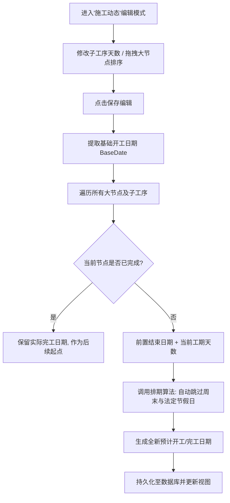

# 品诺筑家 (PNZJ) - 轻量化整装全链路管理系统 PRD (V1.0)

## 1. 执行摘要 (Executive Summary)
我们正在为“品诺筑家”（一家约20人的整装团队）打造一款**轻量化、高质感、全链路贯通**的 CRM+ERP 融合管理系统。解决当前团队在线索流转、报价制作、材料库管理与施工节点把控中存在的“数据孤岛”与“流程僵化”问题。通过解耦报价与材料库、引入客户意向评级 (A/B/C/D) 和 8个标准施工节点的可视化管控，我们将提升销售转化率至少 15%，并将工长的现场管理效率提升 30%，实现从“客户进店”到“项目竣工”的单一数据源全生命周期追踪。

---

## 2. 项目背景与问题陈述 (Problem Statement)

### 谁遇到了问题？
品诺筑家的老板、销售、设计师以及工长。他们目前缺乏一个贴合其业务体量（20人团队）的数字化工具。

### 问题是什么？ (Core Pain Points)
基于目前团队实际的运作状态与历史踩坑经验，我们面临着以下五个深层次的业务痛点：

1. **跟进滞后与管理瓶颈 (Excel时代的低效陷阱)**
   * 过去极度依赖格式各异的传统 Excel 表格，且数据不互通。销售线索跟进往往要等到“每周一次的例会”才进行同步更新。
   * **深层影响**：家装客户决策窗口期极短，周级别的滞后会导致大量高意向客户（A/B级）白白流失。同时，数据维护高度依赖老板一人，老板沦为“进度催办员”和“表哥”，难以抽身做核心战略决策。
2. **“人少工地多”导致的交付黑盒 (沟通断层)**
   * 公司业务发展快，项目经理（工长）人手处于超负荷运转状态。在多个工地间疲于奔命时，工长经常忘记在关键节点（如材料进场、水电验收）向微信群或客户汇报。
   * **深层影响**：施工过程成了“黑盒”，不仅老板无法掌握真实进度，更会引发客户的焦虑和不信任，损害公司“品诺有心，筑家有道”的品牌口碑。
3. **跨角色信息孤岛 (部门间协同错位)**
   * 销售前端沟通的特殊需求、设计师出的最新方案、与工长实际拿到手的施工要求，常常“对不齐”。
   * **深层影响**：缺乏一个贯穿始终的“单一数据源 (Single Source of Truth)”。各部门用不同的工具（微信群、纸质本、Excel），极易出现漏项、错项和部门间的相互扯皮。
4. **传统SaaS的“水土不服”与工具疲劳 (历史弃用史)**
   * 团队之前花钱买过市面上的成熟管理系统，但最终没坚持用下去。原因是那些系统多针对500人以上大企业设计，功能严重冗余、操作极其繁琐。
   * **深层影响**：繁琐的系统增加了员工的抵触情绪，尤其是对于需要在工地现场用手机操作的工长来说简直是灾难。系统必须足够“轻量化”和“傻瓜化”，才能真正落地执行。
5. **报价机制僵化与 UI 审美疲劳 (系统表现层)**
   * 现有的 SaaS 要求报价死板地绑定材料库，无法应对家装中高频的“灵活手写非标项”（如个性化拆除费）。同时，传统企服软件的 UI 显得笨重廉价，无法匹配公司高品质家装的品牌调性。

### 为什么需要现在解决？ (Why Now?)
随着公司业务量的增长，依靠微信群和 Excel 管理客户和工地的模式已达到瓶颈。漏单、错报价、延期交工的隐性成本正在侵蚀公司的利润率与口碑（“品诺有心，筑家有道”）。

---

## 3. 目标用户与角色画像 (Target Users & Personas)

### 核心角色画像
| 角色 | 画像特征与痛点 (Pain Points) | 核心目标 (Jobs-to-be-done) |
| :--- | :--- | :--- |
| **老板/高管** | **痛点**: 看不到全局数据，不知道哪个环节流失率最高，工地延期无法预警。<br>**特征**: 注重数据大盘，需要掌控全局。 | 实时查看公司营收、转化率漏斗；监控施工延期预警；统筹人员组织架构。 |
| **销售** | **痛点**: 客户多且杂，容易忘记跟进；不知道客户处于什么阶段。<br>**特征**: 行动派，不喜欢填繁琐的表单。 | 快速录入线索；为客户打标签 (A/B/C/D) ；写跟进记录；移交设计师。 |
| **设计师** | **痛点**: 制作报价单繁琐，核算容易出错；有些非标项目系统录不进去。<br>**特征**: 注重效率和灵活性。 | 查阅材料大厅标准库；一键生成报价单并支持灵活手写；跟踪客户确认状态。 |
| **工长** | **痛点**: 不想用复杂的软件；在工地用电脑不现实。<br>**特征**: 移动端为主，注重简单粗暴。 | 接收派单；在 8个施工节点（如水电、瓦工）拍照打卡上传。 |

---

## 4. 用户旅程与业务场景 (User Journey & Scenarios)

### 典型使用场景
**场景 A：高意向客户的极速转化**
王销售在门店接待了张先生（毛坯新房），在手机上快速录入信息并标记为 **A级**。系统自动提示分配设计师。赵设计接手后，从**材料大厅**直接拉取“39800极简整装套餐”，再手动加上 500 元的“垃圾清运费”，生成报价单。张先生确认后，系统状态变更为“已签单”。

**场景 B：无缝切入施工阶段**
一旦张先生的单子变更为“已签单”，系统**自动**在“施工管理”模块生成一条新项目，并由老板指派给李工长。该项目头顶带有 **VIP (A级客户透传)** 标识。李工长进场后，点开项目，点击第1节点“开工交底”，上传现场照片，状态变更为“进行中”。

---

## 5. 业务逻辑流程图 (Business Process Flow)

### 5.1 核心业务全链路流转图
```mermaid
graph TD
    subgraph 阶段一：CRM 客户线索转化与跟进
        A[销售录入新线索] --> B[跟进并更新 A/B/C/D 评级]
        B --> C{是否成单?}
        C -->|否| D[标记为无效/流失]
        C -->|是| E[状态变更为"已签单"]
        E --> F((触发撒花动效与签单+1))
        F --> G[设计师制定出图排期]
    end

    subgraph 阶段二：报价管理与材料库联动
        H[创建专属报价单] --> I[引用材料大厅标准品 + 手写非标项]
        I --> J[系统实时核算总价与折后价]
        J --> K{客户确认签约?}
        K -- 退回修改 --> H
        K -- 是 --> L[生成正式合同与收款计划]
    end

    subgraph 阶段三：ERP 施工节点与动态排期管控
        M[基于已签单客户自动生成工地] --> N[老板指派项目经理]
        N --> O[设置项目实际开工日期]
        O --> P[系统自动生成施工动态排期<br>跳过周末/节假日]
        P --> Q[工长/管理员编辑排期]
        Q --> R{节点是否超时?}
        R -- 是 --> S[健康度标红 / 列表置顶预警]
        R -- 否 --> T[现场照片上传 / 节点打卡验收]
        S --> T
        T --> U[8大节点验收完毕 -> 项目竣工]
    end

    G --> H
    L --> M
```

### 5.2 施工排期重算逻辑 (Gantt Recalculation)


---

## 6. 需求功能清单与优先级 (Feature List & Priorities)

| 一级模块 | 二级功能 | 功能描述 | 优先级 |
| :--- | :--- | :--- | :--- |
| **0. 全局看板** | 核心数据指标 | 展示营收、本月签单量、漏斗转化率、延期工地数量预警 | P1 |
| | 响应式UI框架 | 融合风格（暖灰+深咖+杂志留白），支持PC/移动端适配 | P0 |
| **1. 客户线索 (CRM)** | 线索录入与管理 | 字段：姓名、电话、房屋类型、面积、预算、来源 | P0 |
| | 漏斗评级系统 | 强制要求评级 A(高意向), B(对比), C(观望), D(无意向) | P0 |
| | 跟进流记录 | 无限添加沟通日志（时间、内容、下一步计划） | P1 |
| | 状态流转引擎 | 沟通中 -> 已量房 -> 方案阶段 -> 已签单 / 已流失 | P0 |
| **2. 报价管理** | 独立报价单生成 | 基于某个客户线索创建报价/合同 | P0 |
| | 联动材料库 | 能够搜索并直接引用材料大厅的 SKU、单价 | P0 |
| | 自由手写录入 | 支持直接输入名称、价格（不强制关联产品ID） | P0 |
| | 自动核算 | 实时计算总价、优惠金额、最终成交价 | P1 |
| **3. 材料大厅** | 标准物料库 | 字段：名称、品牌、分类、SKU、单价、单位、状态 | P0 |
| | 分类管理 | 主材、辅材、软装、家电、人工、套餐 | P1 |
| **4. 施工管理 (ERP)**| 项目自动创建 | 监听“已签单”动作，自动生成施工记录 | P0 |
| | 视觉分区与预警 | 延期工地飘红置顶；A级客户带 VIP 标识透传 | P1 |
| | 8节点智能排期 | 设置开工时间后自动推算8个节点的起止周期，支持手动微调节假日 | P0 |
| | 8节点打卡流水线 | 支持每个节点的状态切换（未开始、进行中、已完成）及照片上传 | P0 |
| | 施工高级筛选 | 支持按开工时间（年月日）、负责工长、健康度进行多维浮窗筛选 | P1 |
| **5. 跨模块协同** | 全链路协同动态轴 | 贯穿 CRM 与 ERP 的全局留言板，记录客户所有需求变更及跨部门沟通 | P0 |
| **6. 组织架构** | 员工与权限管理 | 角色：admin, sales, designer, manager；支持在职/离职状态切换 | P2 |
| **7. 基础交互规范** | 高级筛选统一 | 全站（线索、报价、合同、施工）统一采用左侧对齐的浮窗下拉菜单进行多维筛选，弃用右侧抽屉以避免层级遮挡 | P0 |
| | 移动端响应式与防裁切 | 适配小屏设备，适当减小字号、统一调整外边距，并在打开任意弹窗/浮窗时启用底层滚动锁定 (Body Scroll Lock) | P0 |

---

## 7. 核心功能细致说明 (Detailed Feature Specs)

### 7.1 全局看板 (Dashboard)
*   **功能描述**：为管理层提供公司整体运营健康度的“驾驶舱”，包含核心数据指标卡片、线索转化率柱状图、本月光荣榜、获客渠道饼图、客单价饼图及线索漏斗分析，最下方为月度营收趋势与目标折线图。
*   **交互逻辑**：
    *   **移动端图表常亮**：为解决移动端无 Hover 状态的问题，所有图表（柱状图、折线图、饼图）均配置了常亮的 `Label` 或 `LabelList`，直接展示具体数值或“名称+百分比”的换行极小字体（如 `10px`），避免文字相互挤压或被裁切。
    *   **全局联动筛选器**：图表上方设有统一的筛选栏（年份、月份、销售人员）。年份下拉框通过扫描 `leadsData` 动态生成已有年份。用户改变任意筛选条件，下方图表数据实时重算渲染。
    *   **设置营收目标**：点击“设置目标”弹出 Modal，支持填入 1-12 月的全年目标。目标数据按“年份”隔离存储，切换年份时自动读取当年的目标值并更新到折线图的虚线上。
*   **业务规则**：饼图分类占比 $\le 5\%$ 时隐藏引线标签以防重叠；光荣榜按签单数量倒序排列取前五。
*   **后置条件**：筛选状态变更后，URL 参数不强制更新（保持轻量级状态管理），但图表组件必须触发重绘。

### 7.2 客户线索 (Leads CRM)
*   **功能描述**：用于登记、追踪和管理潜在客户。包含列表展示、高级筛选、新增线索以及线索详情页（跟进记录、文件与资料）。
*   **交互逻辑**：
    *   **列表高级筛选**：点击筛选按钮弹出 Popover，年份选项覆盖 2020-2026 年，支持按意向评级、状态等多维组合筛选。
    *   **详情页删除操作**：在详情页顶部，删除（垃圾桶）按钮与编辑（小铅笔）按钮并排同行。点击删除后，必须弹出带警示色的二次确认气泡框（绝对定位，带有入场动画）。
*   **业务规则**：客户评级强制为 A/B/C/D；当线索状态变更为“已签单”时，该线索数据自动流转至【合同管理】模块。
*   **后置条件**：确认删除后，系统从本地/数据库中移除该记录，并自动路由跳转回 `/leads` 列表页。

### 7.3 报价管理 (Quotes)
*   **功能描述**：基于客户需求生成并核算报价单，支持从材料库调取标准品或灵活手写非标项目。
*   **交互逻辑**：
    *   **列表房屋信息展示**：列表页“房屋信息”列采用双行结构，第一行为加粗超长截断的地址，第二行为极小字体的 `需求类型 · 面积m² · 预算`（如“毛坯 · 108m² · 15万左右”），与线索列表保持绝对一致。
    *   **详情页客户信息排版**：详情页顶部客户信息卡片采用响应式网格布局。桌面端左侧为 2x2 网格（姓名/电话、房屋信息等），右侧独立显示销售和设计人员（移除头像以减少留白）；移动端自动折叠为单列堆叠。
    *   **底部固定操作栏**：将“删除此报价单”操作移至页面底部悬浮的操作栏最右侧，同样配备向上弹出的二次确认气泡框。
*   **业务规则**：修改明细单价或数量时，系统实时联动计算 `总价`、`折扣` 及 `最终成交价`。
*   **后置条件**：报价单确认无误后可流转为正式合同，客户文件模块（如设计图纸）保持全局同步。

### 7.4 合同管理 (Contracts)
*   **功能描述**：管理已签单客户的正式合同及分期收款计划。
*   **交互逻辑**：
    *   **列表排序与展示**：列表默认按照“签单时间”倒序排列（最新签单排在最前）。表格新增“签单时间”列。
    *   **详情页信息对齐**：详情页左侧基础信息卡片底部增加“签单时间”字段显示。
    *   **删除操作归位**：详情页的“删除此合同记录”按钮放置在顶部标题“合同详情”和“执行中”标签的紧右侧，点击弹出右侧/下方的二次确认框。
*   **业务规则**：合同总额需与收款计划的总额保持一致，支持记录每期收款的状态（待收/已收）。
*   **后置条件**：删除合同为危险操作，确认后移除相关收款记录并返回合同列表。

### 7.5 施工管理 (Projects ERP)
*   **功能描述**：针对 20 人整装团队量身定制的轻量化 ERP，以 8 个标准节点管控工地进度，支持工长现场打卡和异常预警。
*   **交互逻辑**：
    *   **列表页极简设计**：卡片式列表，移除容易引起误解的“工长排班”入口，聚焦于工地状态本身。
    *   **详情页极致响应式排版**：
        *   **桌面端 (Desktop)**：采用 `lg:w-2/3` 和 `lg:w-1/3` 的双列布局。左侧为宽大的“项目施工动态”（纵向手风琴折叠的时间轴），右侧为“重要信息备注”（支持就地点击小铅笔切换为 TextArea 编辑模式）和加长至 `500px` 的“文件与资料”。
        *   **移动端 (Mobile)**：利用 Flex `order` 强制重排模块顺序，依次为：`项目排期与概况 -> 重要信息备注 -> 文件与资料 -> 项目施工动态`。
        *   **移动端防拥挤折叠**：“文件与资料”模块在手机端默认收起，仅显示带下拉箭头的标题栏，点击后展开内部 `400px` 的滚动区域。
    *   **删除工地**：删除按钮位于页面顶部标题栏最右侧，并带有红色的二次确认提示。
*   **业务规则**：8 个节点（开工、水电、木工等）具有严格的前后置依赖；当前节点未完成时，后续节点不可打卡。节点超时自动触发“预警/严重延期”状态并置顶列表。
*   **后置条件**：更新“重要信息备注”后，状态立即保存并退出编辑模式；删除工地将连同所有的打卡记录、图片一并清理。

### 7.6 全局组件：客户文件与资料 (CustomerDocuments)
*   **功能描述**：跨模块（线索、报价、合同、施工）全局共享的附件管理中心。
*   **交互逻辑**：嵌入在各详情页的独立组件。提供“合同”、“图纸”、“其他”分类 Tab。支持模拟上传操作。
*   **业务规则**：基于“客户姓名”（或唯一 Customer ID）作为联合主键。
*   **后置条件**：无论用户从“客户线索”还是“施工现场”上传了一份图纸，系统利用 `localStorage`（模拟后端数据库）将该文件绑定至该客户。当用户切换到该客户的“合同详情”时，该图纸依然可见，实现全链路的无缝流转。

---

## 8. 非功能性需求 (Non-functional Requirements)

1. **UI/UX 规范 (Hybrid Premium Style)**
   *   **色彩**：底色 `#F7F5F2` (暖米灰)，主文字 `#2C2825` (深炭咖)。摒弃纯黑纯白。
   *   **排版**：大留白（Padding 至少 6-8 级），组件使用柔和圆角 (`rounded-xl` 或 `rounded-2xl`)，弱化边框线，依靠阴影 (`shadow-sm`) 和背景色区分层级。
2. **响应式适配 (Responsive Design)**
   *   **移动端优先**：工长打卡、销售外勤跟进绝大部分在手机端完成，要求列表在小屏幕下自动转为卡片流布局 (Card Layout)。
3. **安全性与权限 (Security & Auth)**
   *   离职员工（`is_active = false`）账号即刻失效，但历史录入的线索和签单数据永久保留并可追溯。

---

## 9. 权限控制与数据隔离 (Access Control & Data Isolation)

为保证公司数据安全与员工工作聚焦，系统需实现严格的**基于角色的访问控制 (RBAC)** 与**数据隔离**。

### 9.1 角色定义与页面权限
系统包含四种核心角色，不同角色登录后可见的左侧导航目录及功能模块如下：

| 角色 (Role) | 核心职责 | 可见导航目录 (Pages) | 页面操作权限说明 |
| :--- | :--- | :--- | :--- |
| **老板/管理员 (Admin)** | 掌控全局数据、统筹人员、分配工长 | 全部可见 (看板、线索、报价、材料、施工、组织架构) | 拥有系统的最高权限，可查看、编辑、删除所有模块的全量数据，包括增删改员工账号。 |
| **销售/客服 (Sales)** | 录入线索、跟进客户、促成转化 | 客户线索、报价管理、材料大厅、施工管理 | **不可见**全局看板、组织架构。能够查看自己客户的施工进度，以便随时解答客户的询问并安抚情绪。 |
| **设计师 (Designer)** | 制作方案、核算报价、选配材料 | 客户线索、报价管理、材料大厅、施工管理 | **不可见**全局看板、组织架构。需关注前端客户需求，并在施工阶段跟进落地效果。 |
| **工长/项目经理 (Manager)** | 现场施工管理、节点打卡 | 施工管理、材料大厅 | **不可见**全局看板、客户线索、报价管理、组织架构。专注于后端交付，同时可查看材料库以便核对现场进场物料的规格与型号。 |

### 9.2 数据隔离规则 (Data Isolation Rules)
在允许访问的页面内，系统进一步通过行级数据隔离（Row-Level Security / Filtering）确保员工只能看到与自己相关的数据：

1. **客户线索 (CRM)**：
   * **Admin**：查看所有线索。
   * **Sales / Designer**：仅能查看“负责人”为自己的线索，以及处于“公海”（未分配负责人）的线索。无权查看其他销售的私海客户，防止撞单或飞单。
2. **报价管理 (Quotes)**：
   * **Admin**：查看所有报价单。
   * **Sales / Designer**：仅能查看自己创建的报价单，或关联到自己负责的客户线索的报价单。
3. **施工管理 (ERP)**：
   * **Admin**：查看所有在建项目。
   * **Sales / Designer**：仅能查看“前端业务负责人”为自己的在建项目。用于给客户同步现场进度。
   * **Manager (工长)**：**严格隔离**，登录后仅能看到“项目经理”指派为自己的工地卡片。无法查阅该项目的原始合同总价、客户评级等商业敏感数据。
4. **材料大厅 (Materials)**：
   * 所有角色均可查看材料库，但**仅 Admin** 拥有“新增产品”、“修改底价”、“上下架”的编辑权限，其余角色仅拥有只读或引用权限。

---

## 10. 数据埋点与分析需求 (Data Tracking)

为后续迭代提供数据支撑，1.0/2.0 版本需预留以下关键埋点：

### 10.1 核心转化事件 (Events)
*   `lead_created`: 线索创建事件（属性：来源、初始评级、录入人）。
*   `lead_won`: 签单成功事件（触发撒花时上报，属性：转化周期天数、最终评级、签单人）。
*   `project_started`: 工地开工事件。
*   `node_completed`: 施工大节点验收通过事件（属性：节点名称、是否延期）。

### 10.2 体验与性能指标 (Performance)
*   `file_upload_success` / `file_upload_fail`: 资料库文件上传成功率及耗时。
*   `schedule_recalculated`: 施工动态排期重算触发次数（用于评估用户修改默认模板的频率，若极高则说明默认模板不合理）。
*   `edit_mode_canceled`: 编辑模式撤销次数（用于评估防误触机制的有效性）。

---

## 11. 演进路线与迭代计划 (Roadmap & Out of Scope)

### 暂不包含 (Out of Scope for Current Version)
*   **复杂审批流**：以效率优先，暂不加入“多级领导审批才能发报价”的繁琐流程。
*   **微信生态深度绑定**：暂不开发微信小程序/公众号的客户一端查询功能（C端展示），聚焦于 B端（公司内部）提效。

### 遗留问题与风险 (Open Questions)
*   **遗留问题**：照片存储容量（8个节点的工地照片可能会大量占用对象存储空间，需制定图片压缩上传策略）。