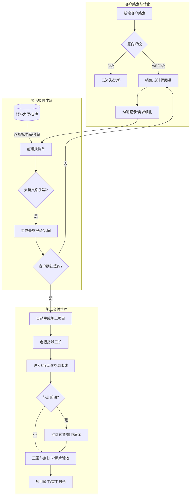

# 品诺筑家 (PNZJ) - 轻量化整装全链路管理系统 PRD (V2.0)

## 1. 执行摘要 (Executive Summary)
我们正在为“品诺筑家”（一家约20人的整装团队）打造一款**轻量化、高质感、全链路贯通**的 CRM+ERP 融合管理系统。解决当前团队在线索流转、报价制作、材料库管理与施工节点把控中存在的“数据孤岛”与“流程僵化”问题。通过解耦报价与材料库、引入客户意向评级 (A/B/C/D) 和 8个标准施工节点的可视化管控，我们将提升销售转化率至少 15%，并将工长的现场管理效率提升 30%，实现从“客户进店”到“项目竣工”的单一数据源全生命周期追踪。

---

## 2. 项目背景与问题陈述 (Problem Statement)

### 谁遇到了问题？
品诺筑家的老板、销售、设计师以及工长。他们目前缺乏一个贴合其业务体量（20人团队）的数字化工具。

### 问题是什么？
1. **数据断层**：前端销售登记的线索，到设计师出方案，再到工长施工，客户信息无法无缝流转，存在严重的信息差。
2. **报价与材料绑定过死**：现有的很多 SaaS 系统要求报价必须从材料库里调取，但实际业务中常常需要灵活的手写项目（如“额外拆除费”）。
3. **施工管控不透明**：签单后，项目转交工长，老板和业务员难以直观看到现场 8 个核心节点的推进进度，经常出现延期或质量盲区。
4. **UI审美疲劳**：市面上的 SaaS 要么过于“极简现代”显得廉价，要么过于“传统企服”显得笨重，不符合一家高品质家装公司的品牌调性。

### 为什么需要现在解决？ (Why Now?)
随着公司业务量的增长，依靠微信群和 Excel 管理客户和工地的模式已达到瓶颈。漏单、错报价、延期交工的隐性成本正在侵蚀公司的利润率与口碑（“品诺有心，筑家有道”）。

---

## 3. 目标用户与角色画像 (Target Users & Personas)

### 核心角色画像
| 角色 | 画像特征与痛点 (Pain Points) | 核心目标 (Jobs-to-be-done) |
| :--- | :--- | :--- |
| **老板/高管** | **痛点**: 看不到全局数据，不知道哪个环节流失率最高，工地延期无法预警。 **特征**: 注重数据大盘，需要掌控全局。 | 实时查看公司营收、转化率漏斗；监控施工延期预警；统筹人员组织架构。 |
| **销售** | **痛点**: 客户多且杂，容易忘记跟进；不知道客户处于什么阶段。 **特征**: 行动派，不喜欢填繁琐的表单。 | 快速录入线索；为客户打标签 (A/B/C/D) ；写跟进记录；移交设计师。 |
| **设计师** | **痛点**: 制作报价单繁琐，核算容易出错；有些非标项目系统录不进去。 **特征**: 注重效率和灵活性。 | 查阅材料大厅标准库；一键生成报价单并支持灵活手写；跟踪客户确认状态。 |
| **工长** | **痛点**: 不想用复杂的软件；在工地用电脑不现实。 **特征**: 移动端为主，注重简单粗暴。 | 接收派单；在 8个施工节点（如水电、瓦工）拍照打卡上传。 |

---

## 4. 用户旅程与业务场景 (User Journey & Scenarios)

### 典型使用场景
**场景 A：高意向客户的极速转化**
王销售在门店接待了张先生（毛坯新房），在手机上快速录入信息并标记为 **A级**。系统自动提示分配设计师。赵设计接手后，从**材料大厅**直接拉取“39800极简整装套餐”，再手动加上 500 元的“垃圾清运费”，生成报价单。张先生确认后，系统状态变更为“已签单”。

**场景 B：无缝切入施工阶段**
一旦张先生的单子变更为“已签单”，系统**自动**在“施工管理”模块生成一条新项目，并由老板指派给李工长。该项目头顶带有 **VIP (A级客户透传)** 标识。李工长进场后，点开项目，点击第1节点“开工交底”，上传现场照片，状态变更为“进行中”。

---

## 5. 业务逻辑流程图 (Business Process Flow)

---

## 6. 需求功能清单与优先级 (Feature List & Priorities)

| 一级模块 | 二级功能 | 功能描述 | 优先级 |
| :--- | :--- | :--- | :--- |
| **0. 全局看板** | 核心数据指标 | 展示营收、本月签单量、漏斗转化率、延期工地数量预警 | P1 |
| | 响应式UI框架 | 融合风格（暖灰+深咖+杂志留白），支持PC/移动端适配 | P0 |
| **1. 客户线索 (CRM)** | 线索录入与管理 | 字段：姓名、电话、房屋类型、面积、预算、来源 | P0 |
| | 漏斗评级系统 | 强制要求评级 A(高意向), B(对比), C(观望), D(无意向) | P0 |
| | 跟进流记录 | 无限添加沟通日志（时间、内容、下一步计划） | P1 |
| | 状态流转引擎 | 沟通中 -> 已量房 -> 方案阶段 -> 已签单 / 已流失 | P0 |
| **2. 报价管理** | 独立报价单生成 | 基于某个客户线索创建报价/合同 | P0 |
| | 联动材料库 | 能够搜索并直接引用材料大厅的 SKU、单价 | P0 |
| | 自由手写录入 | 支持直接输入名称、价格（不强制关联产品ID） | P0 |
| | 自动核算 | 实时计算总价、优惠金额、最终成交价 | P1 |
| **3. 材料大厅** | 标准物料库 | 字段：名称、品牌、分类、SKU、单价、单位、状态 | P0 |
| | 分类管理 | 主材、辅材、软装、家电、人工、套餐 | P1 |
| **4. 施工管理 (ERP)**| 项目自动创建 | 监听“已签单”动作，自动生成施工记录 | P0 |
| | 视觉分区与预警 | 延期工地飘红置顶；A级客户带 VIP 标识透传 | P1 |
| | 8节点智能排期 | 设置开工时间后自动推算8个节点的起止周期，支持手动微调节假日 | P0 |
| | 8节点打卡流水线 | 支持每个节点的状态切换（未开始、进行中、已完成）及照片上传 | P0 |
| | 施工高级筛选 | 支持按开工时间（年月日）、负责工长、健康度进行多维浮窗筛选 | P1 |
| **5. 跨模块协同** | 全链路协同动态轴 | 贯穿 CRM 与 ERP 的全局留言板，记录客户所有需求变更及跨部门沟通 | P0 |
| **6. 组织架构** | 员工与权限管理 | 角色：admin, sales, designer, manager；支持在职/离职状态切换 | P2 |
| **7. 基础交互规范** | 高级筛选统一 | 全站（线索、报价、合同、施工）统一采用左侧对齐的浮窗下拉菜单进行多维筛选，弃用右侧抽屉以避免层级遮挡 | P0 |
| | 移动端响应式与防裁切 | 适配小屏设备，适当减小字号、统一调整外边距，并在打开任意弹窗/浮窗时启用底层滚动锁定 (Body Scroll Lock) | P0 |

---

## 7. 核心功能细致说明 (Detailed Feature Specs)

### 7.1 客户线索录入 (Lead Creation)
*   **交互逻辑**：点击“录入新线索”弹出侧边抽屉或 Modal。
*   **必填字段**：客户姓名、手机号、评级(A/B/C/D)。
*   **选填字段**：房屋类型、面积、预算、详细地址。
*   **后置条件**：录入成功后，状态默认为“沟通中”，销售字段默认为当前登录账号。

### 7.2 报价单核算引擎 (Quote Engine)
*   **规则描述**：
    *   报价单包含 `total_amount` (系统根据明细汇总)、`discount_amount` (手动输入的优惠)、`final_amount` (`total_amount - discount_amount`)。
    *   明细行分为两种类型：【库内产品】(携带 `product_id`)，修改价格不会影响库内基准价；【手写产品】(`product_id`为空，只有 `custom_name`)。

### 7.3 8节点智能排期与打卡 (Smart Scheduling & Check-in)
*   **智能排期逻辑**：在项目启动时，选择【开工时间】，系统依据预设的周期模板（例如：开工1天、水电5天、木工7天等）自动推算后续7个节点的标准完成时间。
*   **手动微调**：针对节假日停工、业主变更导致的延期，提供日历视图允许工长或老板进行单节点或整体时间轴的顺延修改。
*   **打卡交互**：采用纵向时间轴或横向进度条展示。当前处于第 `N` 个节点时，第 `N+1` 个节点置灰不可点击。
*   **节点定义**：1.开工 2.水电 3.木工 4.瓦工 5.墙面 6.定制 7.软装 8.交付。
*   **预警规则**：当实际时间超过当前节点的“排期截止日”时，该项目 `health_status` 自动变为“预警/严重延期”，UI 标红。

### 7.4 高级筛选与交互层级 (Advanced Filtering & Z-Index Management)
*   **筛选入口统一**：客户线索、报价管理、合同管理、施工管理列表页上方统一采用 `<Filter /> 高级筛选` 按钮，放置在搜索框左侧。
*   **浮窗交互**：点击“高级筛选”展开绝对定位的浮窗面板（Dropdown/Popover），并在面板底层添加一个固定定位的透明遮罩（`fixed inset-0 z-40`），实现点击空白处关闭浮窗。
*   **多级嵌套防遮挡**：在高级筛选面板内点击时间、人员等下拉选项时，子级菜单的 `z-index` 设定（如 `z-50`）须高于父级元素，避免下拉选项被下方的其他筛选项遮挡。
*   **全局滚动锁定**：任意 Modal 或大面积浮窗打开时，触发 `document.body.style.overflow = 'hidden'`，阻止底层页面（如表格列表）跟随滚动，优化移动端体验。

### 7.5 全链路协同动态轴 (Full-Lifecycle Collaboration Board)
*   **功能定位**：解决销售、设计师、工长之间信息同步断层的问题，充当该项目的“内部朋友圈”。
*   **使用场景**：
    *   【销售】了解到业主临时决定保留原地板，在此处留言 `@设计师` 注意修改方案。
    *   【设计师】收到业主微信发来的新插座图纸，上传并备注 `@工长` 现场预留。
    *   【工长】在现场发现墙体承重问题，拍照上传并 `@设计师` 请求确认。
*   **信息展示**：按时间倒序排列，包含自动生成的系统日志（如“已签单”、“水电打卡完成”）和手动发布的用户留言。留言可附加图片，且全局共享可见。

---

## 8. 非功能性需求 (Non-functional Requirements)

1. **UI/UX 规范 (Hybrid Premium Style)**
   *   **色彩**：底色 `#F7F5F2` (暖米灰)，主文字 `#2C2825` (深炭咖)。摒弃纯黑纯白。
   *   **排版**：大留白（Padding 至少 6-8 级），组件使用柔和圆角 (`rounded-xl` 或 `rounded-2xl`)，弱化边框线，依靠阴影 (`shadow-sm`) 和背景色区分层级。
2. **响应式适配 (Responsive Design)**
   *   **移动端优先**：工长打卡、销售外勤跟进绝大部分在手机端完成，要求列表在小屏幕下自动转为卡片流布局 (Card Layout)。
3. **安全性与权限 (Security & Auth)**
   *   离职员工（`is_active = false`）账号即刻失效，但历史录入的线索和签单数据永久保留并可追溯。

---

## 9. 权限控制与数据隔离 (Access Control & Data Isolation)

为保证公司数据安全与员工工作聚焦，系统需实现严格的**基于角色的访问控制 (RBAC)** 与**数据隔离**。

### 9.1 角色定义与页面权限
系统包含四种核心角色，不同角色登录后可见的左侧导航目录及功能模块如下：

| 角色 (Role) | 核心职责 | 可见导航目录 (Pages) | 页面操作权限说明 |
| :--- | :--- | :--- | :--- |
| **老板/管理员 (Admin)** | 掌控全局数据、统筹人员、分配工长 | 全部可见 (看板、线索、报价、材料、施工、组织架构) | 拥有系统的最高权限，可查看、编辑、删除所有模块的全量数据，包括增删改员工账号。 |
| **销售/客服 (Sales)** | 录入线索、跟进客户、促成转化 | 客户线索、报价管理、材料大厅、施工管理 | **不可见**全局看板、组织架构。能够查看自己客户的施工进度，以便随时解答客户的询问并安抚情绪。 |
| **设计师 (Designer)** | 制作方案、核算报价、选配材料 | 客户线索、报价管理、材料大厅、施工管理 | **不可见**全局看板、组织架构。需关注前端客户需求，并在施工阶段跟进落地效果。 |
| **工长/项目经理 (Manager)** | 现场施工管理、节点打卡 | 施工管理、材料大厅 | **不可见**全局看板、客户线索、报价管理、组织架构。专注于后端交付，同时可查看材料库以便核对现场进场物料的规格与型号。 |

### 9.2 数据隔离规则 (Data Isolation Rules)
在允许访问的页面内，系统进一步通过行级数据隔离（Row-Level Security / Filtering）确保员工只能看到与自己相关的数据：

1. **客户线索 (CRM)**：
   * **Admin**：查看所有线索。
   * **Sales / Designer**：仅能查看“负责人”为自己的线索，以及处于“公海”（未分配负责人）的线索。无权查看其他销售的私海客户，防止撞单或飞单。
2. **报价管理 (Quotes)**：
   * **Admin**：查看所有报价单。
   * **Sales / Designer**：仅能查看自己创建的报价单，或关联到自己负责的客户线索的报价单。
3. **施工管理 (ERP)**：
   * **Admin**：查看所有在建项目。
   * **Sales / Designer**：仅能查看“前端业务负责人”为自己的在建项目。用于给客户同步现场进度。
   * **Manager (工长)**：**严格隔离**，登录后仅能看到“项目经理”指派为自己的工地卡片。无法查阅该项目的原始合同总价、客户评级等商业敏感数据。
4. **材料大厅 (Materials)**：
   * 所有角色均可查看材料库，但**仅 Admin** 拥有“新增产品”、“修改底价”、“上下架”的编辑权限，其余角色仅拥有只读或引用权限。

---

## 10. 演进路线与迭代计划 (Roadmap & Out of Scope)

### 暂不包含 (Out of Scope for V1.0)
*   **复杂审批流**：V1.0 以效率优先，暂不加入“多级领导审批才能发报价”的繁琐流程。
*   **微信生态深度绑定**：V1.0 暂不开发微信小程序/公众号的客户一端查询功能（C端展示），聚焦于 B端（公司内部）提效。

### 遗留问题与风险 (Open Questions)
*   **遗留问题**：照片存储容量（8个节点的工地照片可能会大量占用对象存储空间，需制定图片压缩上传策略）。
